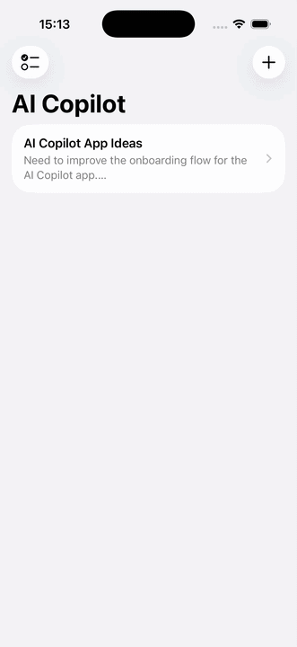
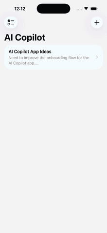

# AI Copilot iOS

An AI-powered iOS copilot that turns notes into actions using LLMs, streaming responses, memory, and function calling.

Designed as a production-style architecture, not a prototype.


## 🔍 Why this project

Most AI apps stop at chat.

This project explores how AI can directly interact with mobile app state through structured actions, turning user input into real outcomes.


## 🎥 Demo



### Improved AI task extraction flow



## 🚀 Features (MVP)

- Notes list + detail view
- AI chat with streaming responses
- Summarize note
- Extract tasks from notes
- Function calling (AI triggers app actions)
- Local persistence (SwiftData)


## 🧠 AI Capabilities

- Structured outputs (JSON schema for tool execution)
- Streaming LLM responses
- Context-aware prompts
- Function calling / tool usage
- Action extraction from text
- Lightweight memory system


## 🏗 Architecture

```text
Features
- Chat
- Notes
- Tasks

Core
- AIClient (LLM communication + streaming)
- ToolCalling (function execution layer)
- Persistence (SwiftData)
- DesignSystem
```


## Use Case

A user writes notes.  
The AI copilot can understand those notes, summarize them, extract action items, and create tasks directly inside the app.


## ⚙️ Tech Stack

- SwiftUI
- Swift Concurrency
- SwiftData
- OpenAI API
- Function calling
- MVVM / modular architecture


## 🧪 Getting Started

### Requirements
- Xcode 15+
- iOS 17+
- OpenAI API key

### Setup

1. Clone the repo
```bash
git clone https://github.com/mariusmaricean/ai-copilot-ios.git
```
2. Open in Xcode
3. Add your API key
4. Run the app

## 🗺 Roadmap

- [ ] Notes CRUD
- [ ] Chat UI
- [ ] Streaming AI responses
- [ ] Summarize note
- [ ] Extract tasks
- [ ] Function calling integration
- [ ] Memory layer
- [ ] Demo video


## 📊 Status

✅ MVP Complete
